# End-to-End Amazon S3 Security Implementation

## Cloud Security Engineering Project

A hands-on cloud security project focused on securing Amazon S3 storage using AWS-native security controls. This project demonstrates how to protect cloud-hosted data through encryption, access control, audit logging, versioning, and secure storage architecture following AWS security best practices.

---

## Project Overview

Misconfigured cloud storage remains one of the most common causes of data exposure incidents. This project was designed to implement and validate multiple security controls within Amazon S3 to improve confidentiality, integrity, availability, and auditability of stored data.

The implementation includes:

* Block Public Access
* AWS KMS Encryption
* Secure Bucket Policies
* S3 Versioning
* Access Logging
* Data Recovery Validation
* Security Architecture Documentation

---

## Project Objectives

* Secure Amazon S3 storage resources
* Prevent unauthorized public access
* Protect data using AWS KMS encryption
* Enforce secure HTTPS-only communication
* Enable logging and auditing capabilities
* Validate version-based recovery mechanisms
* Demonstrate cloud security best practices

---

# Technologies Used

| Service            | Purpose                      |
| ------------------ | ---------------------------- |
| AWS S3             | Secure Object Storage        |
| AWS KMS            | Data Encryption              |
| IAM                | Identity & Access Management |
| S3 Bucket Policies | Access Control               |
| S3 Versioning      | Data Recovery                |
| S3 Access Logging  | Monitoring & Auditing        |

---

# Security Controls Implemented

| Security Control          | Status      |
| ------------------------- | ----------- |
| Block Public Access       | Implemented |
| AWS KMS Encryption        | Implemented |
| Bucket Policy Enforcement | Implemented |
| HTTPS-Only Access         | Implemented |
| Versioning                | Implemented |
| Access Logging            | Implemented |
| Recovery Validation       | Successful  |

---

# Security Architecture

The environment follows a defense-in-depth architecture using multiple security layers to protect cloud-hosted data.

## Architecture Components

* AWS IAM User
* Amazon S3 Bucket
* AWS KMS Encryption
* Bucket Policy
* Block Public Access
* Versioning
* Access Logging
* Log Storage Bucket

### Security Architecture Diagram

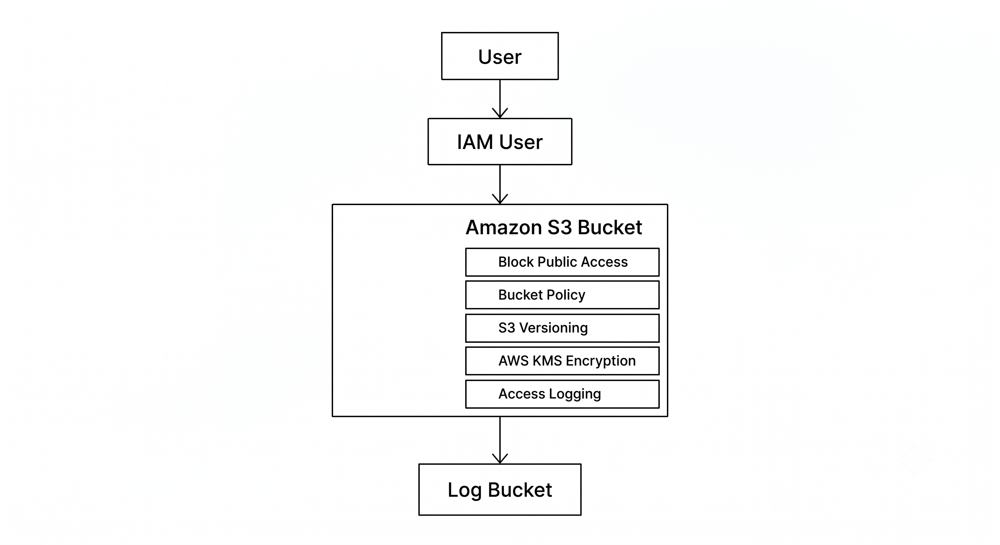

---

# Project Walkthrough

## Step 1 – Amazon S3 Dashboard

Accessed the Amazon S3 service through the AWS Management Console.

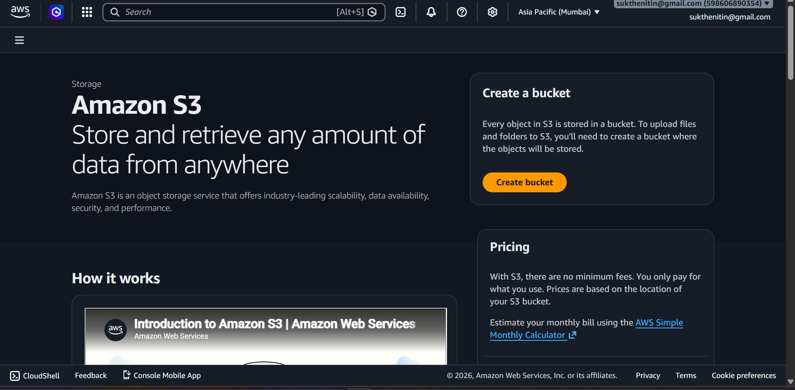

---

## Step 2 – Secure Bucket Creation

Created a new Amazon S3 bucket with secure default configurations.

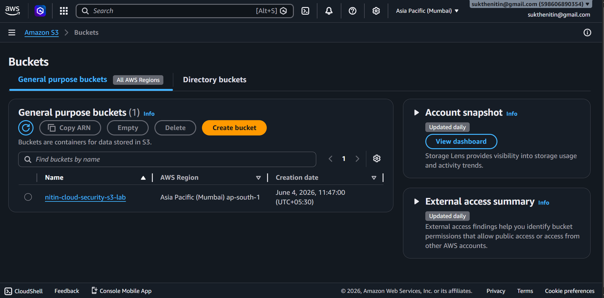

---

## Step 3 – Public Access Protection

Enabled Block Public Access to prevent accidental exposure of stored data.

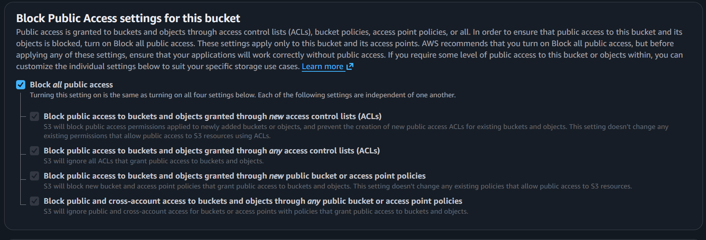

---

## Step 4 – Bucket Overview

Verified bucket configuration and security settings.

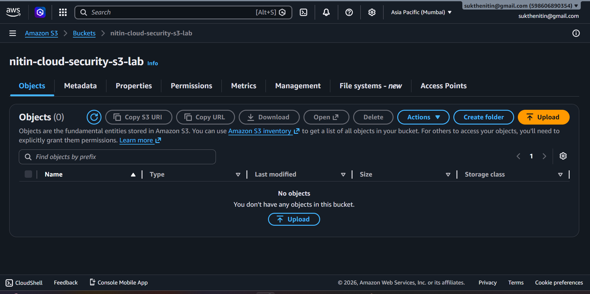

---

## Step 5 – Versioning Configuration

Enabled Amazon S3 Versioning to improve resilience against accidental deletion and data corruption.

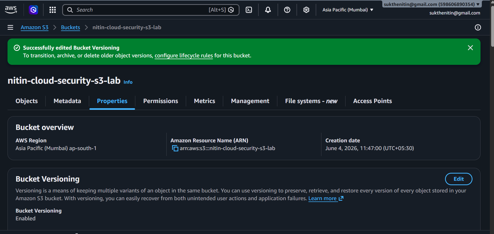

### Security Benefits

* Recovery from accidental deletion
* Object history preservation
* Protection against ransomware-related modifications

---

## Step 6 – Upload Test Object

Uploaded a test object to validate storage and security functionality.

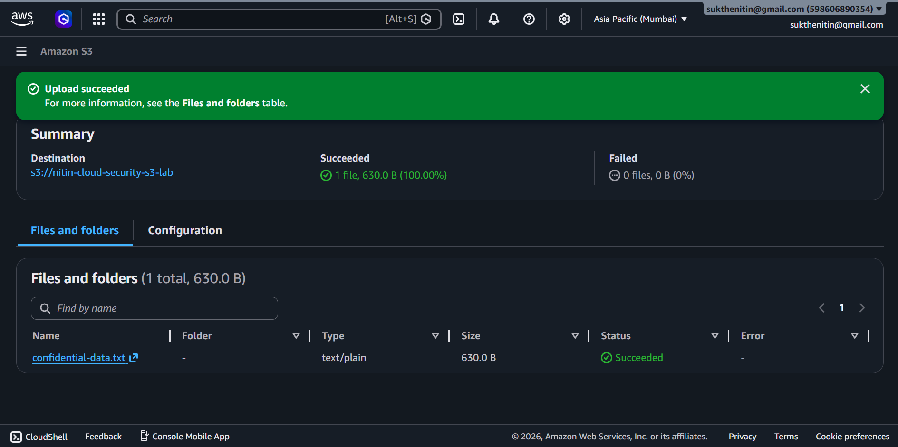

---

## Step 7 – AWS KMS Key Creation

Created a customer-managed AWS KMS key for encryption operations.

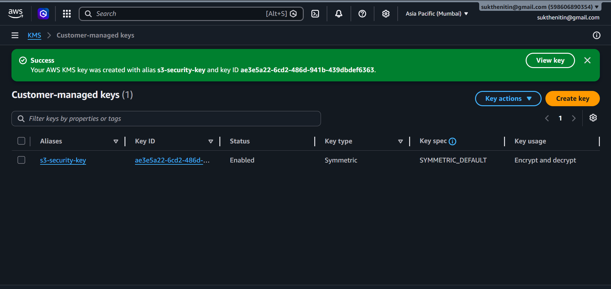

---

## Step 8 – Enable Server-Side Encryption

Configured SSE-KMS encryption for all newly uploaded objects.

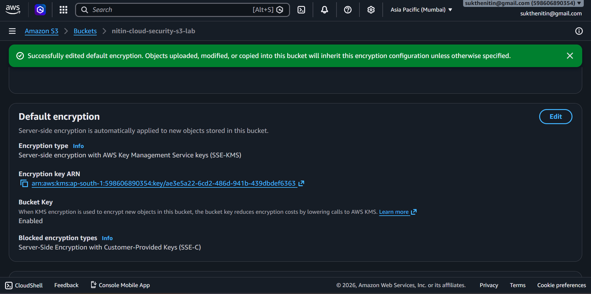

### Security Benefits

* Data confidentiality
* Encryption at rest
* Centralized key management

---

## Step 9 – Bucket Policy Enforcement

Configured bucket policy to enforce secure HTTPS-only communication.

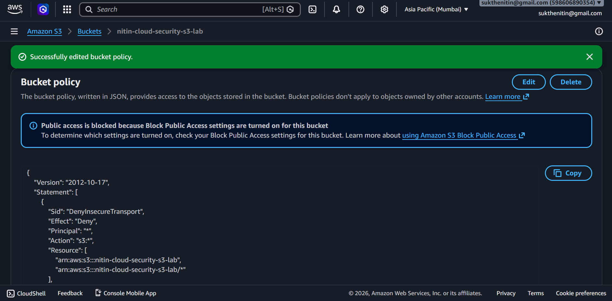

### Security Benefit

All requests using insecure HTTP connections are denied.

---

## Step 10 – Log Bucket Creation

Created a dedicated bucket to store S3 access logs.

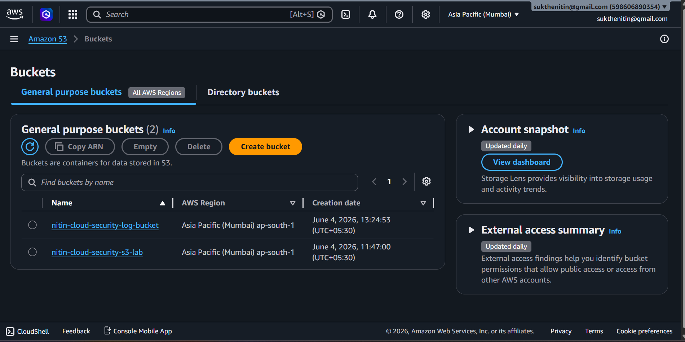

---

## Step 11 – Access Logging

Enabled Server Access Logging to improve visibility and auditing.

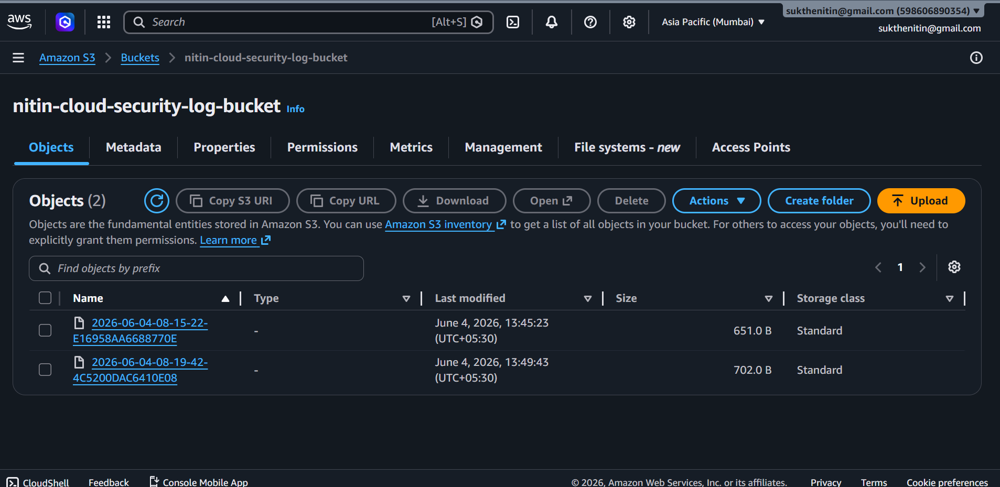

### SOC Analyst Use Cases

* Access monitoring
* User activity analysis
* Incident investigation
* Security auditing

---

## Step 12 – Recovery Validation

Modified and re-uploaded objects to validate S3 Versioning functionality.

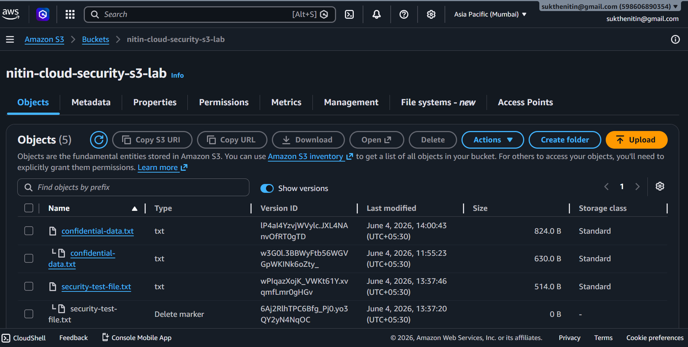

### Validation Results

Multiple object versions were successfully retained and recoverable.

---

# Risk Assessment

## Risks Before Implementation

| Risk                     | Severity |
| ------------------------ | -------- |
| Public Data Exposure     | High     |
| Unencrypted Data Storage | High     |
| Data Loss                | Medium   |
| Lack of Auditing         | Medium   |
| Insecure Communication   | High     |

---

## Risks After Implementation

| Risk                     | Residual Severity |
| ------------------------ | ----------------- |
| Public Data Exposure     | Low               |
| Unencrypted Data Storage | Low               |
| Data Loss                | Low               |
| Lack of Auditing         | Low               |
| Insecure Communication   | Low               |

---

# Project Structure

```text
AWS-S3-Data-Protection-Lab/
│
├── README.md
│
├── docs/
│   ├── Project-Overview.md
│   ├── Security-Architecture.md
│   ├── AWS-KMS-Implementation.md
│   ├── Bucket-Policy-Analysis.md
│   ├── Versioning-Recovery-Test.md
│   └── Security-Best-Practices.md
│
├── screenshots/
│
├── policies/
│   └── bucket-policy.json
│
└── report/
    └── AWS-S3-Security-Project-Report.pdf
```

---

# Documentation

## Technical Documentation

* docs/Project-Overview.md
* docs/Security-Architecture.md
* docs/AWS-KMS-Implementation.md
* docs/Bucket-Policy-Analysis.md
* docs/Versioning-Recovery-Test.md
* docs/Security-Best-Practices.md

---

## Security Report

A detailed cloud security assessment report is available in:

```text
report/AWS-S3-Security-Project-Report.pdf
```

---

# Key Skills Demonstrated

### Cloud Security

* Amazon S3 Security
* AWS KMS Encryption
* Secure Cloud Storage
* Data Protection

### Security Operations

* Security Monitoring
* Access Auditing
* Incident Readiness
* Risk Assessment

### AWS Security

* Identity and Access Management
* Bucket Policies
* Encryption Management
* Secure Configuration

---

# Lessons Learned

This project provided practical experience implementing cloud security controls commonly used in enterprise AWS environments.

Key learning outcomes included:

* Secure Amazon S3 configuration
* Encryption key management
* Storage access control
* Audit logging
* Data recovery strategies
* Security documentation

---

# Future Enhancements

Potential future improvements include:

* AWS CloudTrail Integration
* Amazon GuardDuty Monitoring
* AWS Security Hub
* AWS Config Compliance Rules
* IAM Access Analyzer
* CloudWatch Security Monitoring

---

# Author

Nitin Sukthe

Cloud Security | AWS Security | SOC Analyst | Cybersecurity

---

# Disclaimer

This project was performed in a controlled AWS environment for educational, research, and portfolio development purposes. No production systems or third-party environments were targeted or affected.
